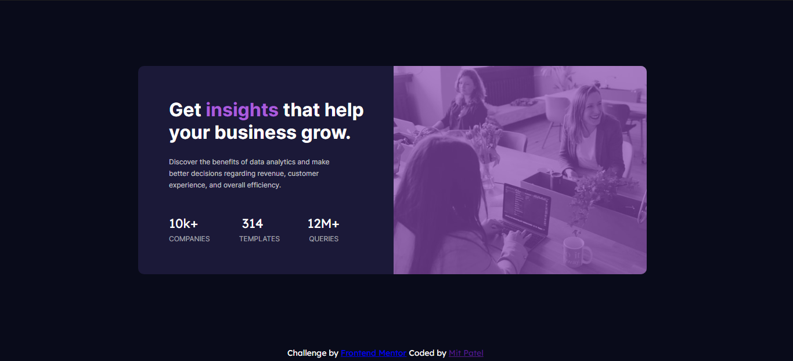
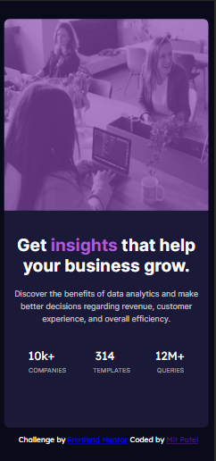

# Frontend Mentor - Stats preview card component solution

## Table of contents

- [Overview](#overview)
  - [The challenge](#the-challenge)
  - [Screenshot](#screenshot)
  - [Built with](#built-with)
  - [What I learned](#what-i-learned)
- [Author](#author)

## Overview

### The challenge

Users should be able to:
- View the optimal layout depending on their device's screen size

### Screenshot




### Links

- Solution URL: [Add solution URL here](https://your-solution-url.com)
- Live Site URL: [Add live site URL here](https://your-live-site-url.com)

## My process

### Built with

- Semantic HTML5 markup
- CSS custom properties
- Mobile-first workflow

### What I learned

From this challenge I learned more about how to build mobile friendly components by using the code created for the desktop versions. More importantly, I learned how media queries work based off given parameters which in this case is a 
screen size. Using this you can change the css code depending on how you want it to appear to build the mobile version.

The code snippet for the mobile version:

```css
/*Code to make the card mobile friendly.*/
@media (max-width: 500px) {
    .card-component {
        height: 48rem;
        width: 24rem;
        position: relative;
        left: 10px; top: 110px;
    }

    .card-info {
        position: absolute;
        padding: 100% 5%;
        text-align: center;
    }

    .meeting-img {
        width: 24rem;
        border-top-left-radius: 10px;
        border-bottom-right-radius: 0px;
        position: absolute;
        left: 0px; top: 0px;
    }
    
    .img-layer {
        width: 24rem;
        border-top-left-radius: 10px;
        border-bottom-right-radius: 0px;
        position: absolute;
        left: 0px; top: 0px;
    }

    .summary {
        font-size: 15px;
        line-height: 23px;
    }

    .attribution {
        position: absolute;
        top: 900px; left: 45px;
    }
}
```
## Author

- Frontend Mentor - [@Mit Patel](https://www.frontendmentor.io/profile/mitpatel)

